# AZ-104 Lab - Week 01
## Azure Resource Groups, RBAC, Resource Locks and Cost Management

> Hands-on laboratory developed while preparing for the Microsoft AZ-104 certification.

---

## Overview

This lab demonstrates the fundamental Azure Resource Manager (ARM) concepts covered during Week 01 of the AZ-104 learning path.

The exercises include:

- Creating Resource Groups
- Managing resources using Azure CLI
- Assigning Azure RBAC roles
- Testing permissions with different users
- Creating Resource Locks
- Managing Resource Groups
- Configuring Cost Management Budgets
- Cleaning up deployed resources

---

## Objectives

- Understand Azure Resource Groups
- Practice Azure CLI administration
- Configure Azure RBAC
- Validate least privilege access
- Protect resources using CanNotDelete Locks
- Configure Azure Budgets
- Practice resource cleanup

---

## Technologies

- Azure Resource Manager
- Azure CLI
- Azure Cloud Shell
- Azure RBAC
- Azure Resource Locks
- Azure Cost Management
- Microsoft Entra ID

---

## Lab Environment

| Item | Value |
|------|-------|
| Subscription | Azure Subscription 1 |
| Region | East US |
| Authentication | Microsoft Entra ID |
| Azure CLI | Azure Cloud Shell |
| Tenant | thiagorubio.com.br |

---

## Lab Steps

### 1. Create Resource Groups

Create two Resource Groups using Azure CLI with custom tags.

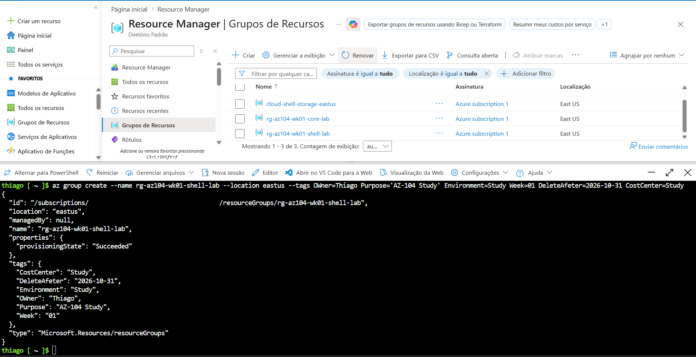

---

### 2. Verify Resource Groups

List all Resource Groups.

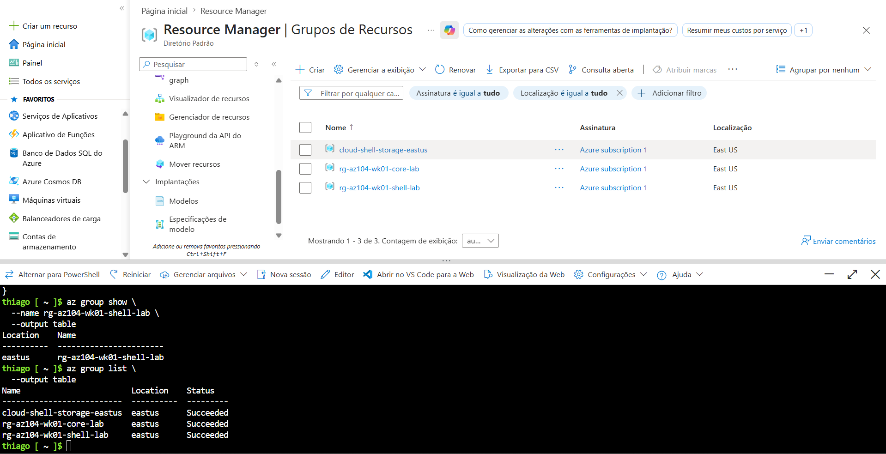

---

### 3. Configure Azure RBAC

Assign the Reader role using Azure CLI and validate the assignment in the Azure Portal.

CLI

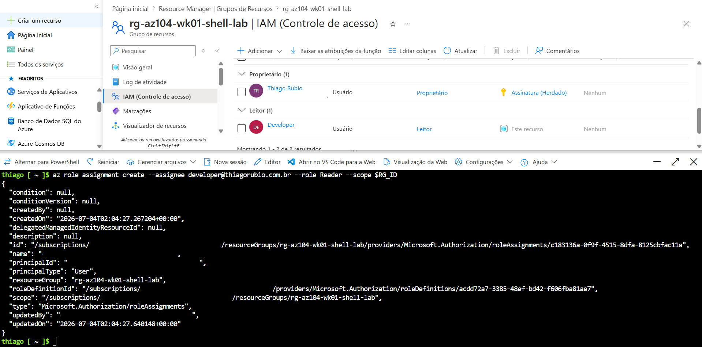

Portal

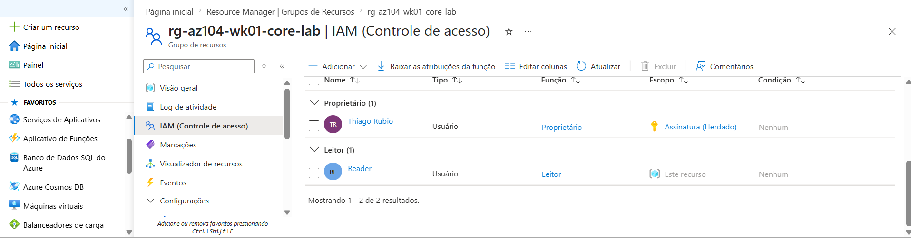

---

### 4. Validate Permissions

Validate access using dedicated Reader and Developer accounts.

Reader Account

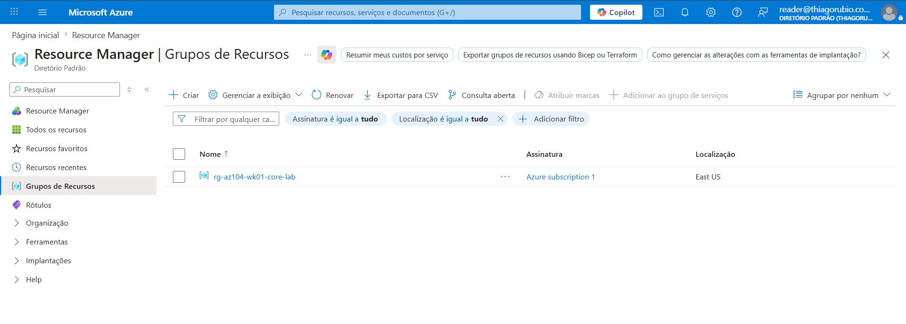

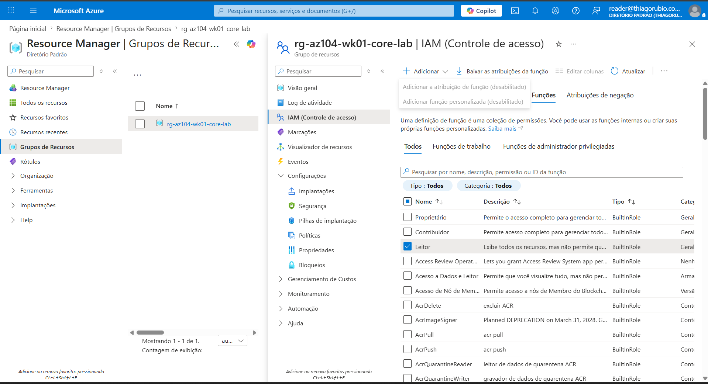

Developer Account


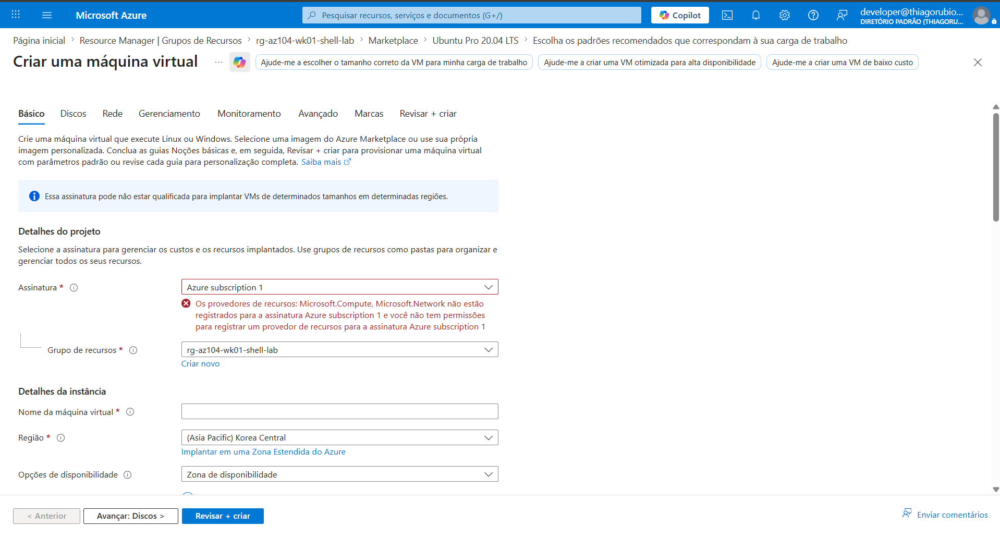

---

### 5. Protect Resources

Create a CanNotDelete Resource Lock.

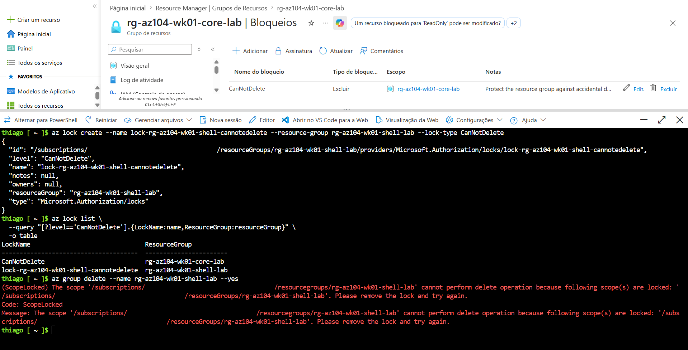

---

### 6. Configure Budget

Configure a monthly Azure Budget.

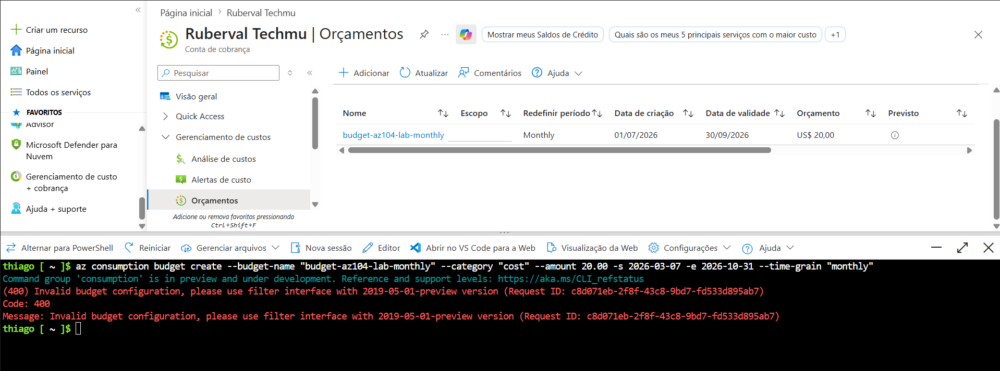

---

### 7. Cleanup

Remove Locks and delete Resource Groups.

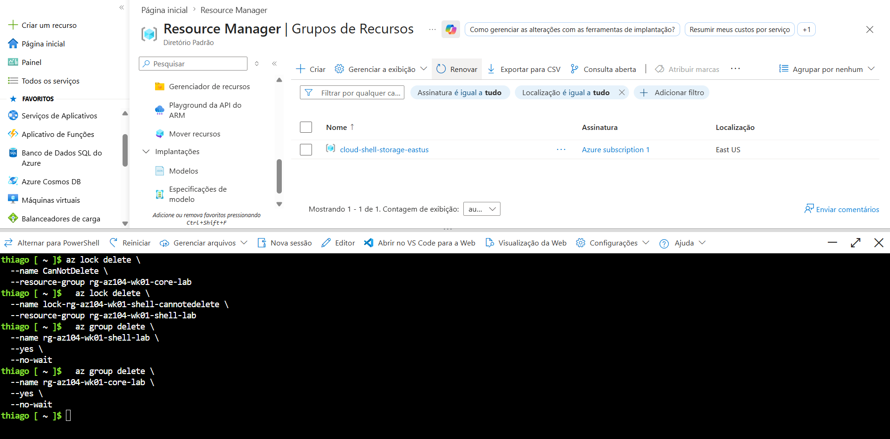

---

# Challenges Encountered

## Azure CLI Budget Preview Issue

### Error

```
Invalid budget configuration,
please use filter interface with 2019-05-01-preview version
```

### Root Cause

The Azure CLI Budget command currently relies on a preview API that is not fully compatible with the latest Cost Management implementation.

### Resolution

Configured the Budget using the Azure Portal instead.

---

## Missing Scope Parameter

### Error

```
the following arguments are required:

--scope
```

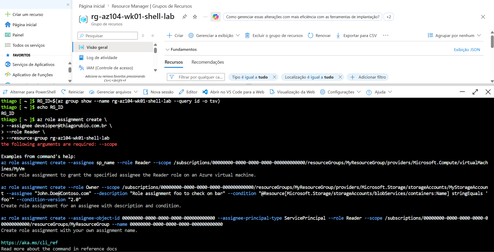

### Root Cause

The role assignment command requires the Resource Group ID to be provided as the Scope.

### Resolution

Retrieve the Resource Group ID first and reuse it in the role assignment command.

---

## Resource Lock Preventing Deletion

### Error

The Resource Group could not be deleted because a CanNotDelete Lock was applied.

### Resolution

Remove the Lock before deleting the Resource Group.

---

# Lessons Learned

- Azure RBAC permissions depend on the selected Scope.
- Resource Locks override delete operations.
- Azure CLI preview commands may not behave as expected.
- Azure Portal can be used as an alternative when preview APIs fail.
- Testing permissions with dedicated accounts is essential.

---

# Next Steps

- Azure Policy
- Tags
- ARM Templates
- Bicep
- Terraform
- Networking
