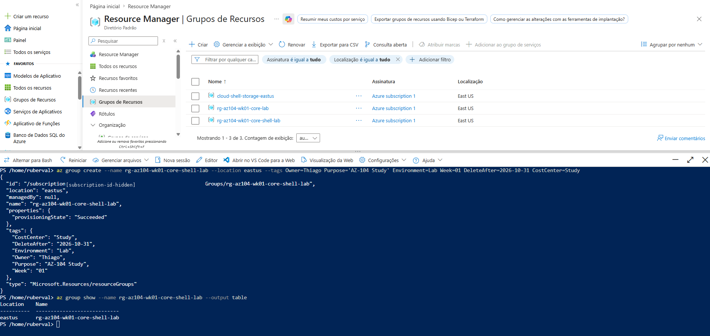
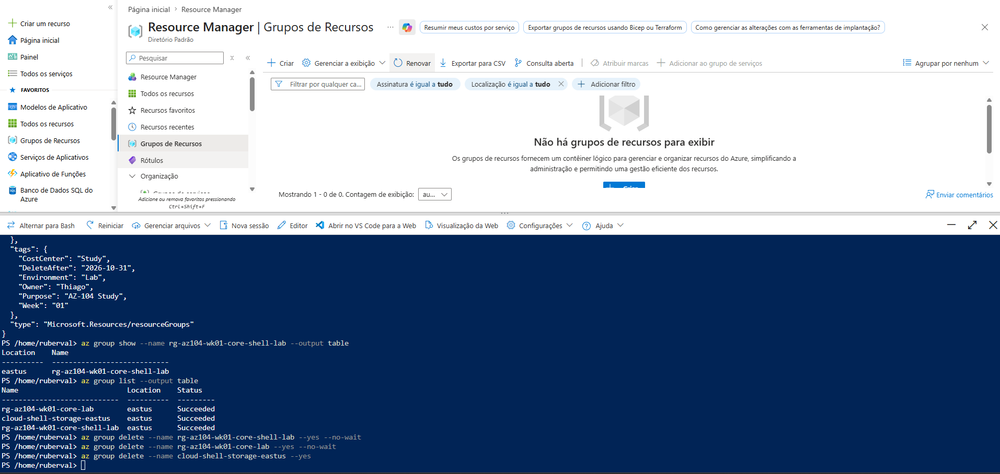

# Semana 01 — Governança Básica: Resource Groups, Tags, Budget, Lock e RBAC

Esta semana teve como objetivo criar a base inicial de governança para os laboratórios da certificação **AZ-104: Microsoft Azure Administrator**.

O laboratório consolidou conceitos fundamentais de administração Azure, incluindo organização de recursos, padronização por tags, controle de custos, proteção contra exclusão acidental e atribuição de permissões com Azure RBAC.

## Objetivo

Criar uma estrutura inicial de governança no Azure utilizando:

- Resource Groups.
- Tags.
- Budget.
- Lock do tipo `CanNotDelete`.
- Azure RBAC com role `Reader`.
- Validação via Azure Portal e Azure CLI.
- Processo de limpeza dos recursos.

## Conceitos praticados

- Hierarquia de escopo no Azure.
- Diferença entre Subscription, Resource Group e Resource.
- Organização de recursos por ciclo de vida.
- Aplicação de tags para governança e controle de custos.
- Criação de Budget para acompanhamento de consumo.
- Uso de Management Locks para proteção contra exclusão.
- Atribuição de permissões com Azure RBAC.
- Princípio do menor privilégio.
- Validação e troubleshooting via Azure CLI.

## Recursos utilizados

| Recurso | Finalidade |
|---|---|
| Resource Group | Organização dos recursos do laboratório |
| Tags | Identificação de proprietário, projeto, ambiente e controle de custos |
| Budget | Acompanhamento de consumo da assinatura |
| Management Lock | Proteção contra exclusão acidental |
| Azure RBAC | Controle de acesso por escopo |
| Role Reader | Permissão de leitura para usuário de laboratório |

## Estrutura criada

| Item | Nome |
|---|---|
| Resource Group | `rg-az104-wk01-core-lab` |
| Resource Group via CLI | `rg-az104-wk01-core-shell-lab` |
| Budget | `budget-az104-lab-shell-monthly` |
| Lock | `lock-rg-az104-wk01-cannotdelete` |
| Role | `Reader` |

## Tags utilizadas

As tags foram aplicadas para facilitar organização, rastreabilidade, governança e controle de custos.

| Tag | Valor |
|---|---|
| `Owner` | `Thiago` |
| `Project` | `AZ-104` |
| `Environment` | `Lab` |
| `Week` | `01` |
| `Purpose` | `Study` |
| `CostCenter` | `Study` |
| `DeleteAfter` | `2026-10-31` |

## Etapa 1 — Resource Groups e Tags

Foram criados Resource Groups pelo Azure Portal e pelo Azure CLI para praticar as duas formas de administração.

A criação via Azure CLI também permitiu validar o uso de tags diretamente na implantação do recurso.

### Validação

- Resource Groups criados com sucesso.
- Tags aplicadas corretamente.
- Recursos visíveis no Azure Portal.
- Validação realizada via Azure CLI.

### Screenshot

## Etapa 2 — Budget Management

Foi criado um Budget mensal no Azure Portal para acompanhar o consumo da assinatura utilizada nos laboratórios da AZ-104.

### Configuração do Budget

| Configuração | Valor |
|---|---|
| Name | `budget-az104-lab-shell-monthly` |
| Amount | `USD 20` |
| Time Grain | `Monthly` |
| Scope | Subscription |

### Azure CLI

Também foi realizada uma tentativa de criação do Budget via Azure CLI utilizando o comando:

`az consumption budget create`
## Resultado

HTTP 400 - Invalid budget configuration

## Observação

O Budget foi criado com sucesso pelo Azure Portal.

Durante a tentativa via Azure CLI, o comando retornou erro HTTP 400. O próprio terminal informou que o grupo de comandos az consumption está em Preview, indicando que o comportamento pode variar ou exigir parâmetros/API diferentes.

Para este laboratório, a criação pelo Azure Portal foi considerada válida, pois o objetivo principal era configurar controle de custo na assinatura de estudos.

### Screenshot
Colocar Screenshot do lab 2

## Etapa 3 - Lock CanNotDelete

Foi aplicado um lock do tipo CanNotDelete no Resource Group rg-az104-wk01-core-lab para validar a proteção contra exclusão acidental.

Após a criação do lock, foi realizada uma tentativa de exclusão do Resource Group. A operação falhou conforme esperado, retornando erro ScopeLocked.

Esse comportamento confirmou que o lock estava ativo e impedindo a exclusão do Resource Group.

Validação
Lock criado com sucesso.
Lock listado via Azure CLI.
Tentativa de exclusão bloqueada.
Erro ScopeLocked retornado conforme esperado.

### Screenshot
Colocar Screenshot do lab 3

## Etapa 4 - RBAC Reader

Foi realizada uma atribuição de Azure RBAC no escopo do Resource Group rg-az104-wk01-core-lab.

A role Reader foi atribuída a um usuário de laboratório para validar o princípio de menor privilégio.

O teste demonstrou que a role Reader permite visualizar recursos no escopo definido, mas não permite criar, alterar, excluir recursos ou atribuir permissões.

Validação
Resource Group identificado via Azure CLI.
Role Reader atribuída com sucesso.
Role assignment criada no escopo do Resource Group.
Atribuição validada no Azure Portal e via Azure CLI.

### Screenshot
Colocar Screenshot  lab4

## Troubleshooting

Durante os testes, alguns comportamentos importantes foram documentados.

Erro ao criar Budget via Azure CLI, o comando az consumption budget create retornou erro HTTP 400:
`Invalid budget configuration`
O erro aparenta estar relacionado ao grupo de comandos az consumption, que está em Preview.

A alternativa utilizada foi criar o Budget diretamente pelo Azure Portal.

Erro ao usar parâmetro incorreto no RBAC

Também foi testado o uso de --resource-group no comando az role assignment create.

O comando exige o parâmetro --scope, utilizando o ID completo do escopo.

A correção foi obter o ID do Resource Group e utilizar:
`--scope $RG_ID`

Comandos utilizados

Os comandos completos utilizados neste laboratório estão disponíveis no arquivo:

commands.azcli

## Limpeza dos recursos

Após a validação dos testes, os recursos criados para o laboratório devem ser removidos para evitar custos desnecessários.

Antes de excluir o Resource Group protegido por lock, é necessário remover o lock CanNotDelete.

Ordem recomendada de limpeza
Remover role assignment de teste.
Remover lock `CanNotDelete`.
Excluir Resource Groups criados para o laboratório.
Validar no Azure Portal se os recursos foram removidos.
Revisar Cost Management.

## Checklist final da Semana 1
[x] Criar Resource Group pelo Azure Portal.
[x] Criar Resource Group pelo Azure CLI.
[x] Aplicar tags.
[x] Criar Budget pelo Azure Portal.
[x] Documentar erro do Budget via Azure CLI.
[x] Criar lock CanNotDelete.
[x] Validar bloqueio de exclusão com erro ScopeLocked.
[x] Criar role assignment com role Reader.
[x] Validar Azure RBAC no escopo do Resource Group.
[x] Documentar comandos utilizados.
[x] Registrar screenshots com dados sensíveis ocultos.
[x] Remover permissões temporárias.
[x] Remover lock antes da limpeza final.
[x] Excluir Resource Groups de laboratório.
[x] Validar Cost Management após a limpeza.

## Lições aprendidas
Resource Groups ajudam a organizar recursos por ciclo de vida.
Tags são fundamentais para governança, rastreabilidade e controle de custos.
Budgets ajudam a acompanhar consumo, mas não bloqueiam automaticamente cobranças.
Alguns comandos da Azure CLI podem estar em Preview e apresentar limitações.
Locks do tipo CanNotDelete protegem recursos contra exclusão acidental.
Azure RBAC controla quem pode fazer o quê e em qual escopo.
A role Reader permite visualização, mas não permite alteração ou exclusão de recursos.
O parâmetro --scope é essencial em comandos de role assignment.
Documentar erros e correções torna o portfólio mais realista e profissional.
Todo laboratório deve terminar com validação e plano de limpeza.

## Segurança

Nenhum dado sensível deve ser publicado neste repositório.

Antes de publicar screenshots, foram ocultados ou removidos:

 - Subscription ID.
 - Tenant ID.
 - UPNs/e-mails completos.
 - Object IDs.
 - Principal IDs.
 - Role Assignment IDs.
 - Dados pessoais ou sensíveis.

## Status

Concluído tecnicamente.

